# Analyse de sensibilité MAELIA

Ce dépôt regroupe les notebooks, scripts et figures utilisés pour analyser la sensibilité des sorties MAELIA. La démarche suit trois étapes :

1. analyser les premiers résultats lorsque le sol et le climat varient ;
2. isoler les opérations techniques avec `terrainSA` et entraîner un métamodèle ;
3. identifier des valeurs seuils locales avec des arbres de décision.

## Partie 1 — Premières analyses : sol et climat variables

Les premières analyses sont réalisées sur un terrain où le climat et le type de sol changent entre parcelles. Dans ce cadre, les sorties sont très fortement structurées par le contexte pédoclimatique. Les paramètres techniques existent bien dans le signal, mais leur contribution est largement masquée par les contrastes entre zones météo et types de sol.

Ce résultat est central pour l'interprétation : lorsque le sol et le climat varient, l'analyse de sensibilité répond d'abord à une question spatiale, pas seulement agronomique. Elle montre quelles zones et quels sols expliquent les variations, mais elle ne permet pas encore d'isoler proprement les effets des itinéraires techniques.

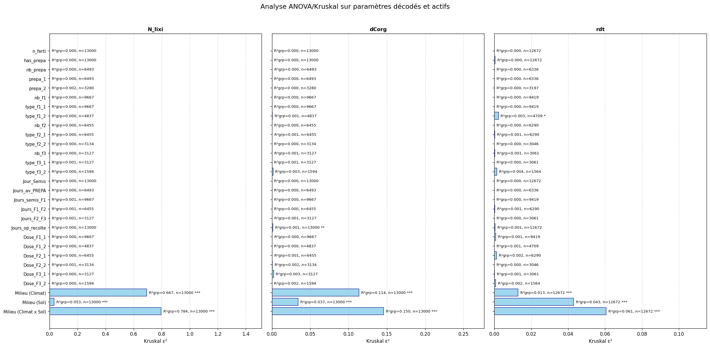

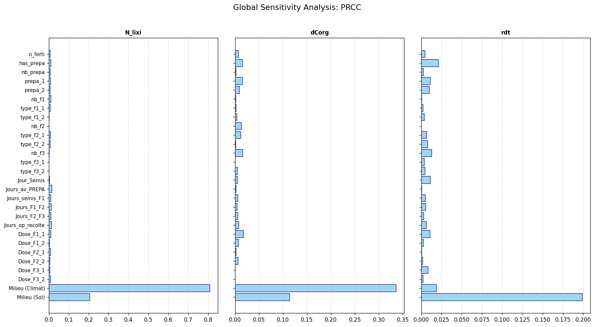

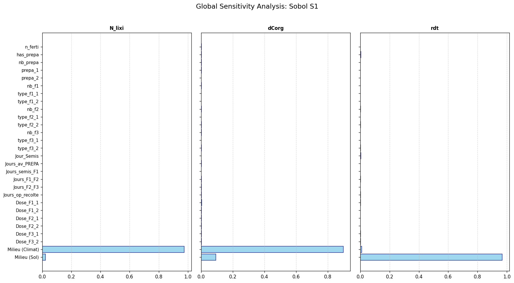

Les figures par groupes sol-climat confirment cette lecture : les distributions des sorties sont fortement séparées par les contextes environnementaux.

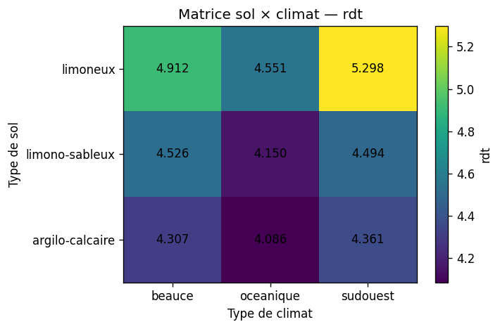

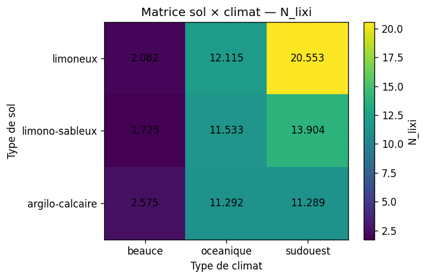

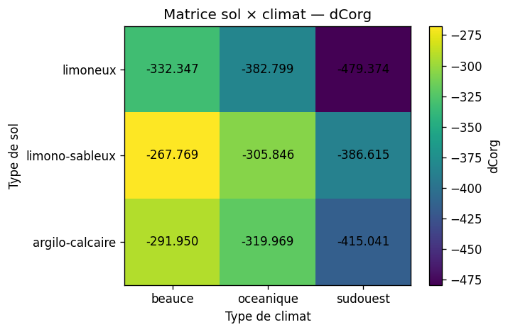

L'entraînement d'un métamodèle XGBoost n'a pas donné de résultats suffisamment satisfaisant pour réaliser une analyse de sensibilité plus approfondie sur ces données.

## Partie 2 — terrainSA : opérations techniques et métamodèle

Pour isoler les leviers techniques, `terrainSA` clone la parcelle `beauce_5_1`. Les simulations comparent alors des itinéraires techniques dans un contexte constant : même sol, même géométrie et même zone météo. Cette construction réduit fortement le bruit lié au milieu et rend les effets agronomiques plus lisibles.

Dans cette partie, plusieurs métamodèles sont comparés afin d'approximer les sorties MAELIA à partir des paramètres techniques. Le meilleur modèle retenu est `ExtraTrees` pour les trois sorties. Il sert ensuite de support aux indices globaux de Sobol et de Shapley.

| Sortie | Métamodèle retenu | Q2 test |
|---|---:|---:|
| `N_lixi` | ExtraTrees | 0.863 |
| `dCorg` | ExtraTrees | 0.991 |
| `rdt` | ExtraTrees | 0.959 |

L'ANOVA/Kruskal à un facteur fait ressortir des leviers cohérents avec les mécanismes agronomiques attendus :

| Sortie | Paramètres dominants |
|---|---|
| `N_lixi` | `Jour_Semis`, `Jours_op_recolte`, préparation du sol et calendrier de fertilisation |
| `dCorg` | `n_ferti`, `Jours_semis_F1`, doses et organisation des apports |
| `rdt` | `n_ferti`, `Jours_semis_F1`, `Dose_F1_1`, nombre/type d'apports |

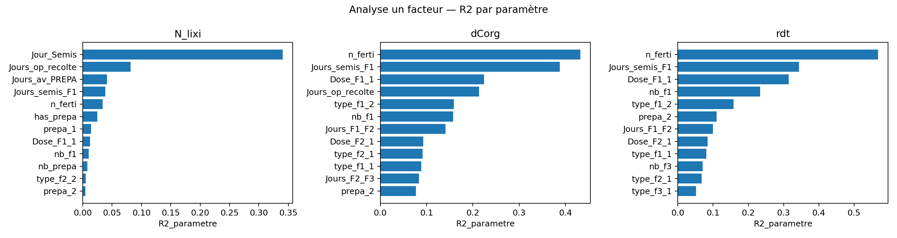

Les interactions à deux facteurs restent plus faibles que les effets principaux, mais elles ne sont pas nulles. Elles concernent surtout les combinaisons entre dates d'intervention, récolte et fertilisation. Les heatmaps ci-dessous ne montrent que le `R2_interaction`.

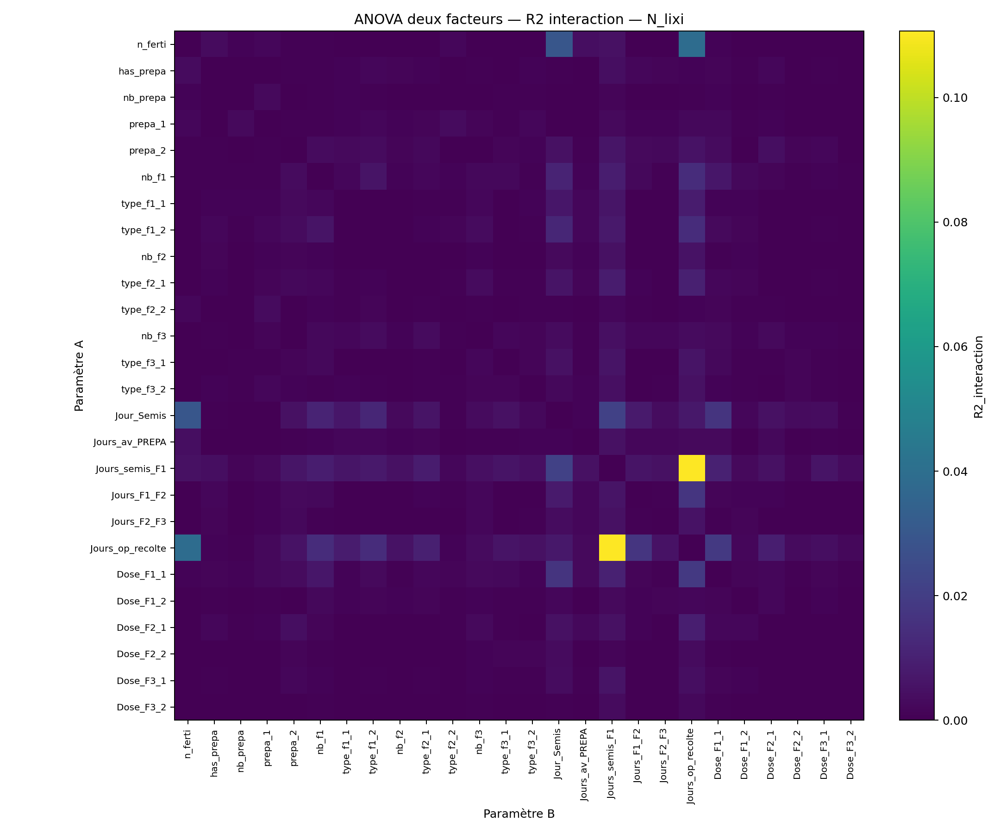

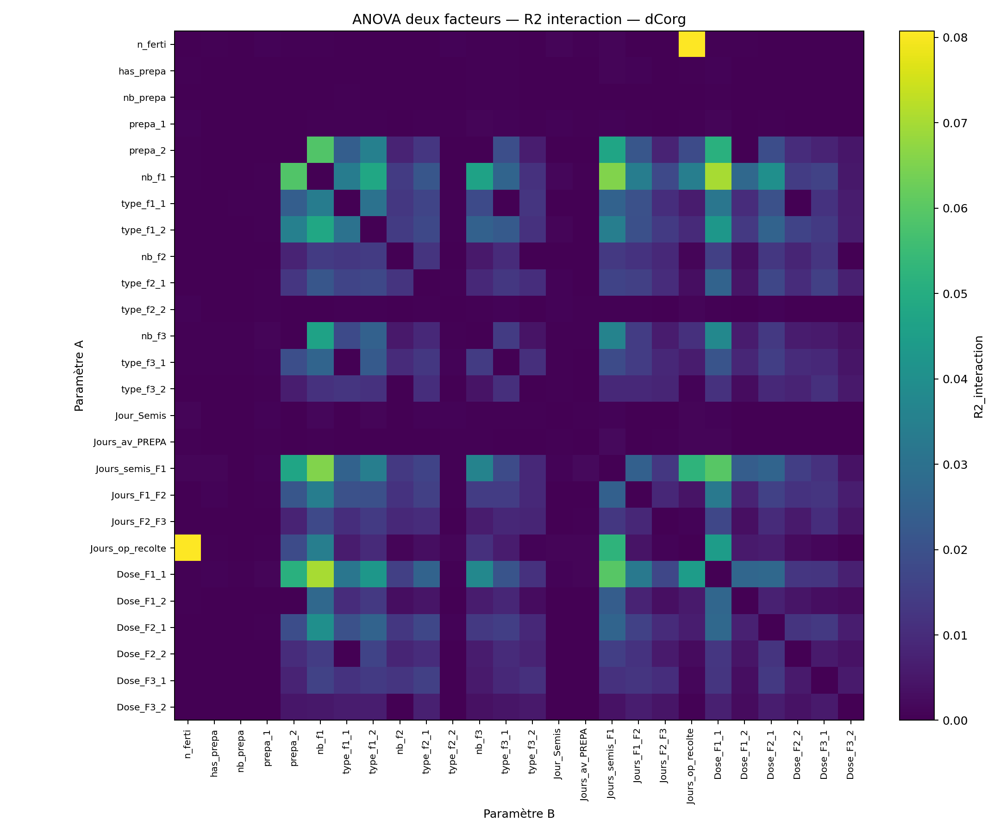

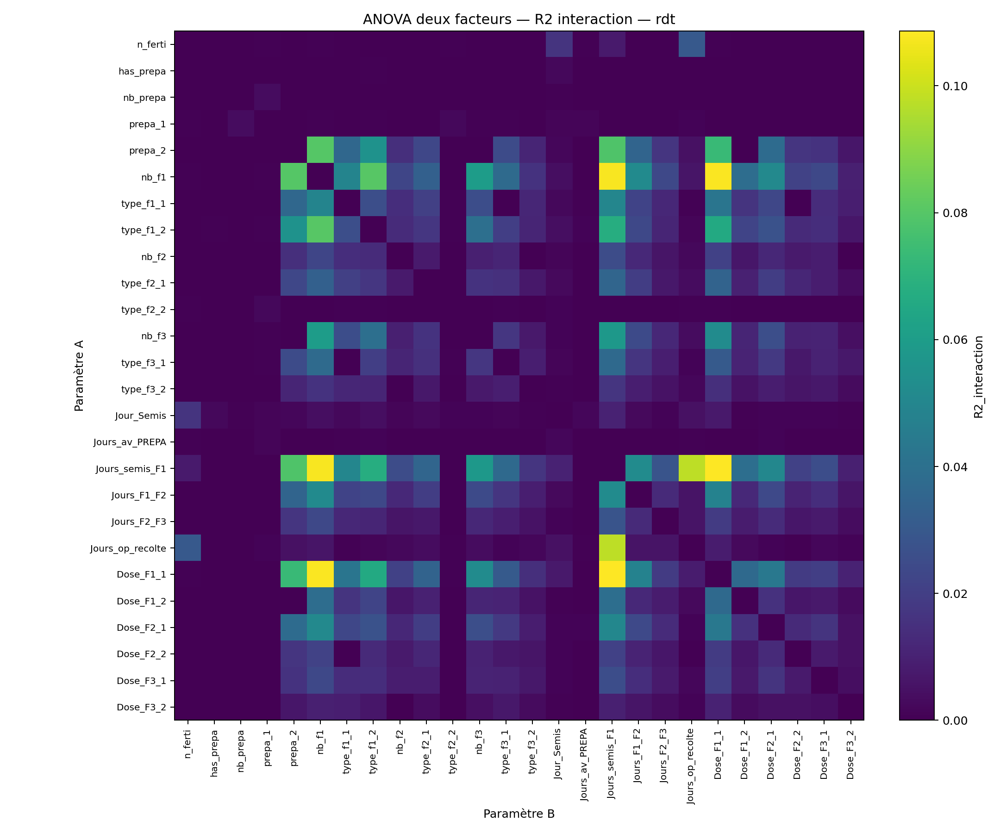

Les indices de Sobol d'ordre total et les valeurs de Shapley confirment cette lecture : la lixiviation est surtout sensible à la date de semis et au calendrier de récolte, tandis que le rendement et le carbone organique sont davantage structurés par la fertilisation.

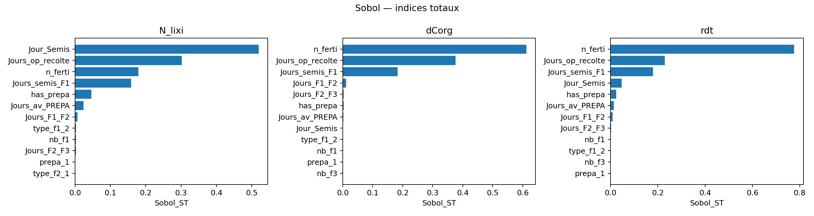

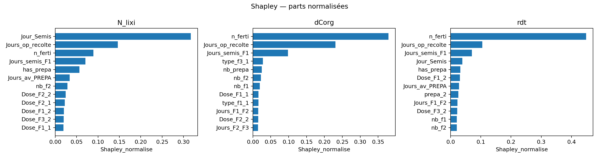

## Partie 3 — Seuils locaux par arbres de décision

Le notebook `analysis/Analyse_seuils_decision_tree.ipynb` prolonge l'analyse en cherchant des seuils interprétables. L'objectif n'est pas de battre le métamodèle ExtraTrees en précision, mais d'obtenir des règles locales du type : au-delà de tel seuil, la réponse change de régime.

Des arbres de régression contraints sont entraînés sur les mêmes données `terrainSA`. Les performances restent suffisantes pour une lecture qualitative des régimes, surtout pour `dCorg` et `rdt`.

| Sortie | Q2 test arbre | Paramètres principalement utilisés |
|---|---:|---|
| `N_lixi` | 0.596 | `Jour_Semis`, `Jours_op_recolte`, `Jours_semis_F1`, `n_ferti` |
| `dCorg` | 0.863 | `n_ferti`, `Jours_op_recolte`, `Jours_semis_F1` |
| `rdt` | 0.813 | `n_ferti`, `Jours_semis_F1`, `Jours_op_recolte`, `Jour_Semis` |

### Seuils principaux

Pour `N_lixi`, le premier seuil global porte sur `Jour_Semis` autour de `284.3` : les semis plus tardifs conduisent à une lixiviation moyenne plus élevée dans l'arbre. Des seuils locaux sur `Jours_op_recolte` autour de `67`, `124` et `175` jours structurent ensuite des régimes plus fins.

Pour `dCorg`, le seuil le plus net est catégoriel : `n_ferti == 0` sépare fortement les régimes. Les situations sans fertilisation sont moins négatives en moyenne pour `dCorg`, tandis que les régimes fertilisés combinés à des récoltes tardives et à certains délais de fertilisation conduisent aux pertes de carbone les plus fortes.

Pour `rdt`, `n_ferti == 0` est également le premier embranchement fort : l'absence de fertilisation tire le rendement vers le bas. Les meilleurs régimes apparaissent lorsque `n_ferti != 0`, avec des seuils secondaires sur `Jours_semis_F1`, `Jours_op_recolte` et `Jour_Semis`.

| Sortie | Exemple de seuil/règle | Moyennes séparées par la règle |
|---|---|---:|
| `N_lixi` | `Jour_Semis <= 284.3` vs `> 284.3` | 3.21 vs 4.09 |
| `N_lixi` | `Jours_op_recolte <= 67.34` vs `> 67.34` | 2.66 vs 3.82 |
| `dCorg` | `n_ferti != 0` vs `n_ferti == 0` | -251 vs -120 |
| `dCorg` | `Jours_op_recolte <= 97.76` vs `> 97.76` | -196 vs -303 |
| `rdt` | `n_ferti != 0` vs `n_ferti == 0` | 4.27 vs 3.67 |
| `rdt` | `Jours_semis_F1 <= 169.2` vs `> 169.2` | 3.81 vs 4.31 |

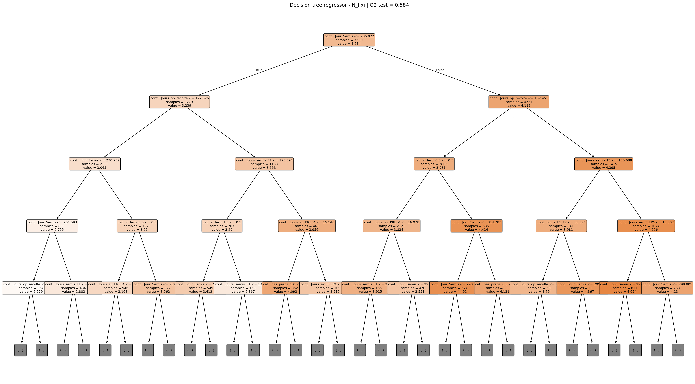

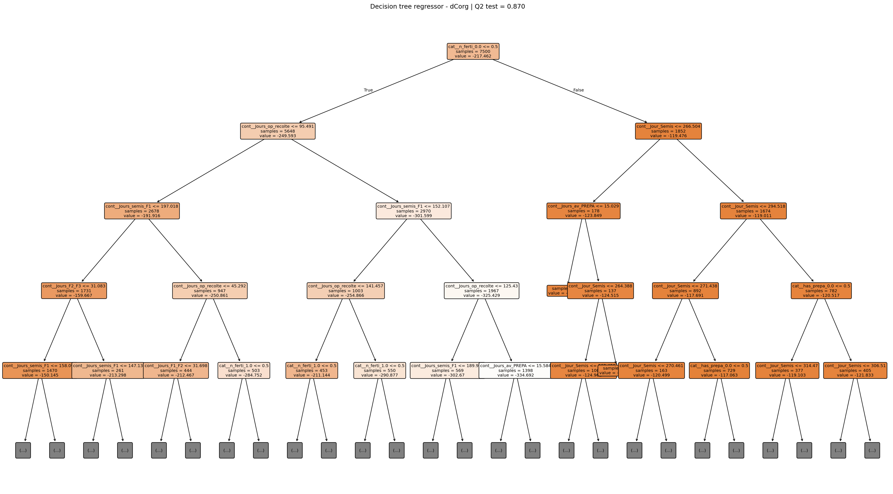

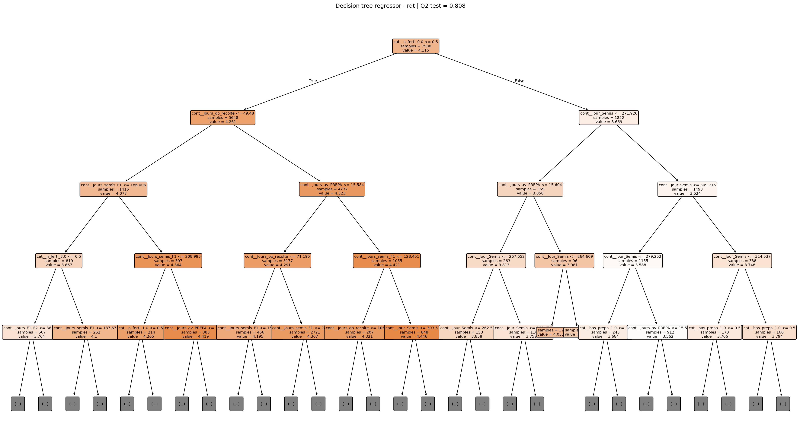

Les importances internes aux arbres confirment les seuils précédents : `Jour_Semis` domine pour `N_lixi`, tandis que `n_ferti` domine très nettement pour `dCorg` et `rdt`.

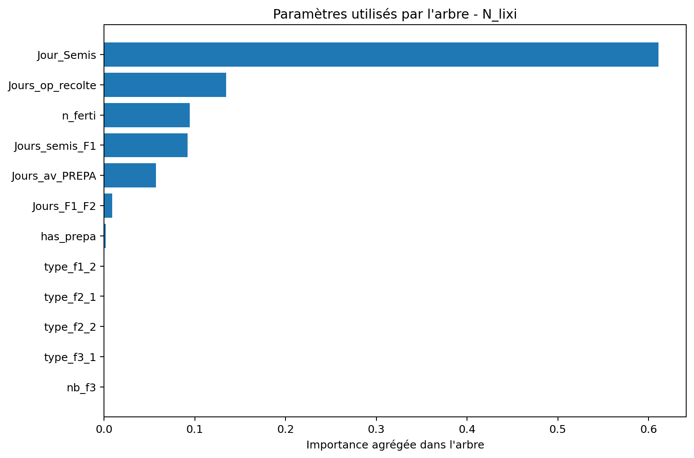

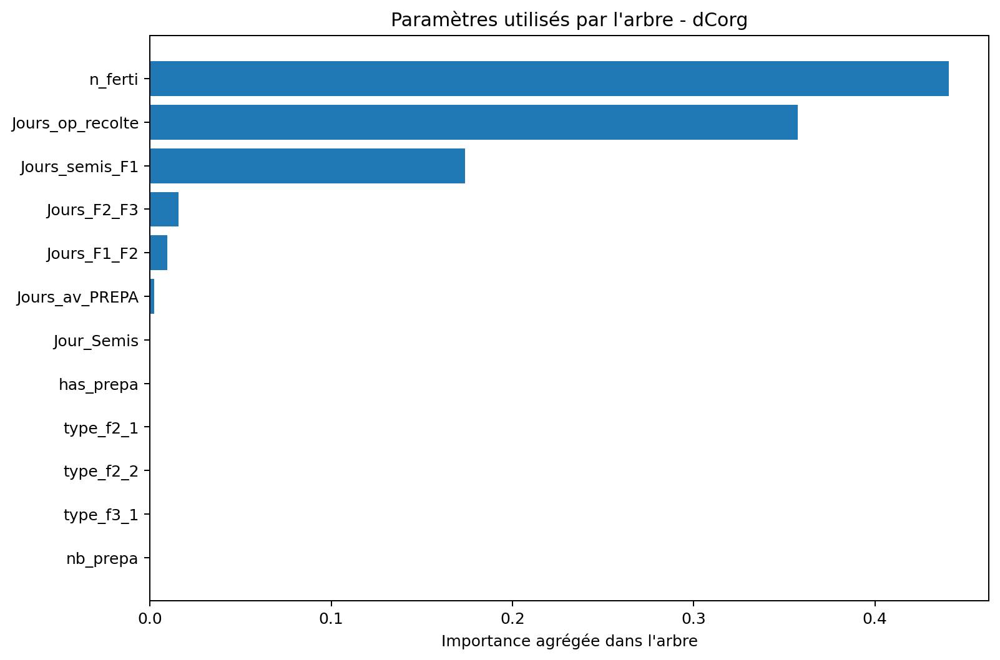

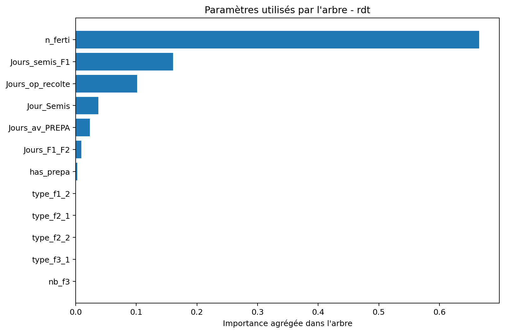

Une analyse complémentaire entraîne aussi des arbres sur les résidus d'un modèle additif. Elle montre qu'il reste des structures locales non linéaires, en particulier pour `dCorg` (`Q2` résiduel ≈ 0.591) et plus modérément pour `rdt` (`Q2` résiduel ≈ 0.298). Pour `N_lixi`, le signal résiduel est plus faible (`Q2` résiduel ≈ 0.172), ce qui suggère que les principaux effets sont déjà largement captés par les seuils directs et les effets principaux.

## Fichiers utiles

- Analyse terrainSA et métamodèles : `analysis/Analyse_terrainSA.ipynb`
- Analyse des seuils : `analysis/Analyse_seuils_decision_tree.ipynb`
- Résultats terrainSA : `analysis/terrainSA_results/`
- Résultats arbres de décision : `analysis/decision_tree_thresholds/`
- Notebook de lancement terrainSA : `simulations/batch_simulations_smt_terrainSA.ipynb`
- Figures historiques terrainTest : `figs/`
