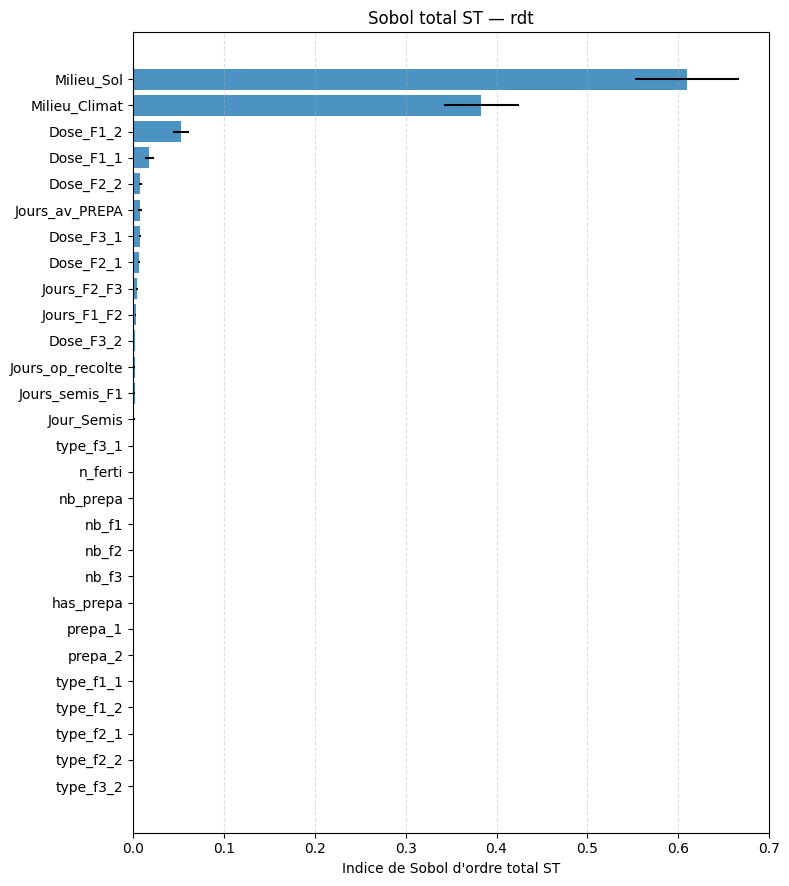
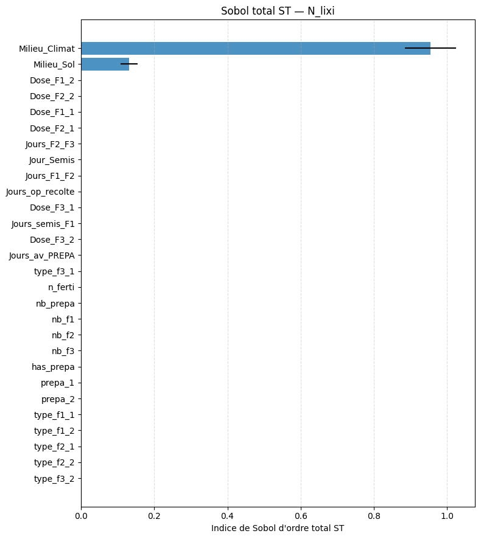
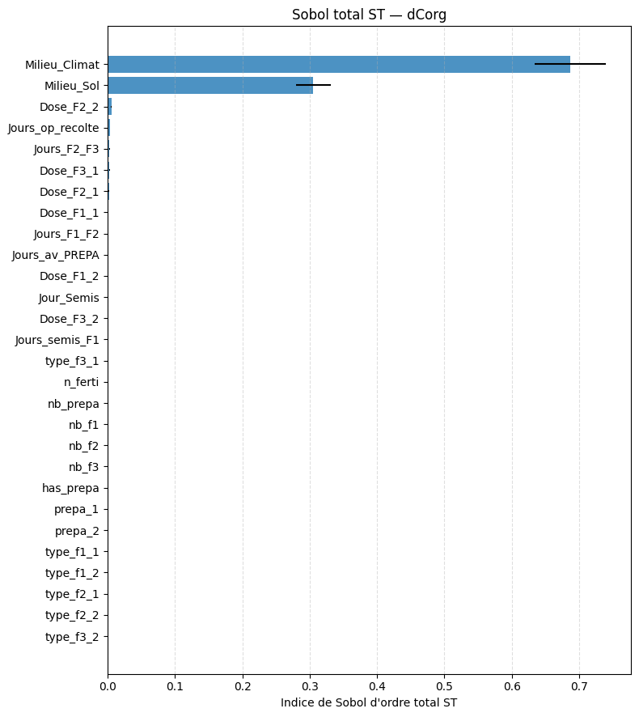

# Analyse de sensibilité MAELIA

Ce dépôt regroupe les scripts, notebooks et figures utilisés pour analyser la sensibilité des sorties MAELIA. Deux cadres d'analyse sont distingués :

- `terrainTest`, qui conserve l'hétérogénéité spatiale initiale et permet de mesurer le poids du climat et du type de sol.
- `terrainSA`, construit autour de copies de la parcelle `beauce_5_1`, afin de neutraliser le sol et le climat et de se concentrer sur les opérations techniques.

## Résultat principal

L'analyse `terrainTest` montre que le climat et le type de sol dominent très largement les sorties. C'est un résultat important : sur un territoire hétérogène, les effets environnementaux masquent une grande partie du signal lié aux choix techniques. La construction de `terrainSA` est donc justifiée pour étudier plus finement les leviers agronomiques dans un contexte contrôlé.

Dans `terrainSA`, le meilleur métamodèle retenu est `ExtraTrees` pour les trois sorties. Les scores de généralisation sont bons, en particulier pour `dCorg` et `rdt`.

| Sortie | Métamodèle retenu | Q2 test |
|---|---:|---:|
| `N_lixi` | ExtraTrees | 0.863 |
| `dCorg` | ExtraTrees | 0.991 |
| `rdt` | ExtraTrees | 0.959 |

## Analyse terrainTest : domination du sol et du climat

Les figures issues de `terrainTest` indiquent que les contrastes entre zones climatiques et types de sol expliquent l'essentiel des variations observées. Les paramètres techniques existent, mais leur effet est secondaire dans ce cadre spatialement hétérogène.

Les graphiques croisant les sorties avec le sol et le climat confirment visuellement cette domination : les groupes environnementaux structurent fortement les distributions.

Les indices de Sobol estimés par métamodèle XGBoost vont dans le même sens : lorsque le plan conserve toute l'hétérogénéité du terrain, les effets liés au contexte pédoclimatique restent prépondérants.

## Analyse terrainSA : opérations techniques à sol et climat fixes

`terrainSA` clone la parcelle `beauce_5_1`. Les simulations comparent donc des itinéraires techniques dans un contexte constant : même sol, même géométrie de parcelle, même zone météo. Cette configuration rend le signal agronomique beaucoup plus lisible.

### ANOVA / Kruskal à un facteur

L'analyse à un facteur fait ressortir des leviers différents selon la sortie :

| Sortie | Paramètres dominants |
|---|---|
| `N_lixi` | `Jour_Semis`, `Jours_op_recolte`, préparation du sol et calendrier de fertilisation |
| `dCorg` | `n_ferti`, `Jours_semis_F1`, doses et organisation des apports |
| `rdt` | `n_ferti`, `Jours_semis_F1`, `Dose_F1_1`, nombre/type d'apports |

### ANOVA à deux facteurs : interactions

Les interactions sont plus faibles que les effets additifs, mais elles ne sont pas nulles. Elles concernent surtout les combinaisons entre dates d'intervention, récolte et fertilisation. Les heatmaps ci-dessous ne montrent que le `R2_interaction`, afin de ne pas mélanger l'effet combiné global avec la part strictement interactive.

### Indices de Sobol

Les indices de Sobol d'ordre total confirment les principaux leviers identifiés par l'ANOVA. Pour `N_lixi`, la date de semis ressort fortement. Pour `dCorg` et `rdt`, la structure de la fertilisation domine davantage.

### Valeurs de Shapley

Les valeurs de Shapley donnent une lecture globale de contribution moyenne. Elles confirment que `Jour_Semis` est central pour `N_lixi`, tandis que `n_ferti` porte une grande part de l'information pour `dCorg` et `rdt`.

## Fichiers utiles

- Notebook d'analyse : `analysis/Analyse_terrainSA.ipynb`
- Résultats terrainSA : `analysis/terrainSA_results/`
- Notebook de lancement terrainSA : `simulations/batch_simulations_smt_terrainSA.ipynb`
- Figures historiques terrainTest : `figs/`

## Lecture générale

La comparaison des deux analyses met en évidence le rôle du dispositif expérimental. Avec `terrainTest`, l'analyse répond surtout à une question spatiale : quels contextes sol-climat structurent les sorties ? Avec `terrainSA`, elle répond à une question agronomique : quels choix techniques influencent les sorties lorsque le contexte pédoclimatique est fixé ?

Cette séparation est utile pour la suite : elle évite d'attribuer aux opérations techniques un effet qui proviendrait en réalité du sol ou du climat.
